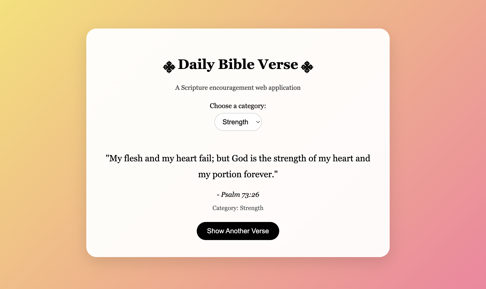

# Daily Bible Verse Web Application

An interactive web application that provides users with encouraging Scripture through a clean and responsive interface. Users can browse randomly generated Bible verses and filter verses by category to find encouragement for different situations.

## Features

- Random Bible verse generation
- Category-based filtering
- Interactive user interface
- Responsive design for desktop and mobile devices
- Dynamic content updates without page refreshes
- Clean and modern styling

## Categories

- Anxiety
- Hope
- Faith
- Strength
- Peace

## Technologies Used

- HTML5
- CSS3
- JavaScript

## Screenshot



## How It Works

The application stores Bible verses in a JavaScript array along with their references and categories. Users can select a category or view all verses. When the **"Show Another Verse"** button is clicked, JavaScript randomly selects and displays a verse that matches the selected category.

The application uses DOM manipulation and event listeners to dynamically update content without requiring the page to reload.

## What I Learned

Through this project, I strengthened my understanding of:

- JavaScript arrays and objects
- Event listeners
- Random number generation
- DOM manipulation
- Responsive web design
- Front-end development fundamentals
- User interface design

## Future Improvements

- Search verses by keyword
- Save favorite verses
- Add user accounts
- Expand the Scripture database
- Integrate a Bible API
- Add dark mode
- Track recently viewed verses

## Project Structure

```
Daily-Bible-Verse/
│
├── index.html
├── style.css
├── script.js
├── screenshot.png
└── README.md
```

## Author

Rebecca Yanni

Computer Science Student at Rutgers University–Newark

## Preview

This project was created to practice front-end web development using HTML, CSS, and JavaScript while building an interactive application that dynamically displays categorized Bible verses through user-selected filtering and random generation.
